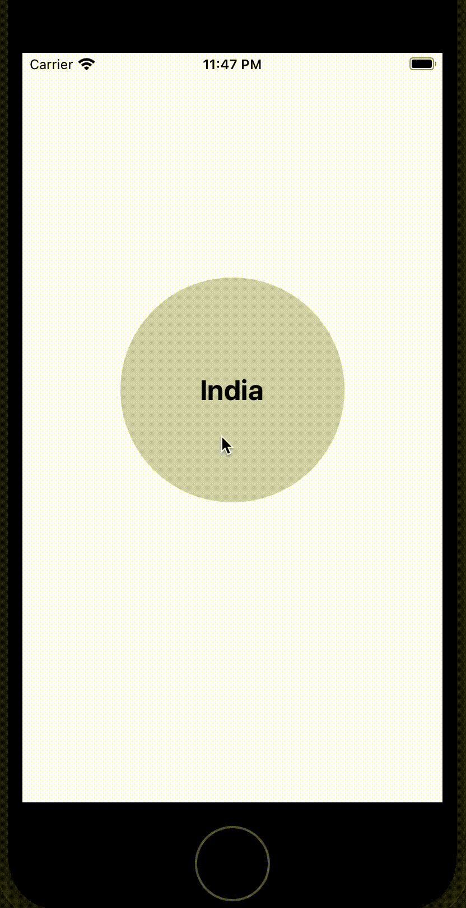
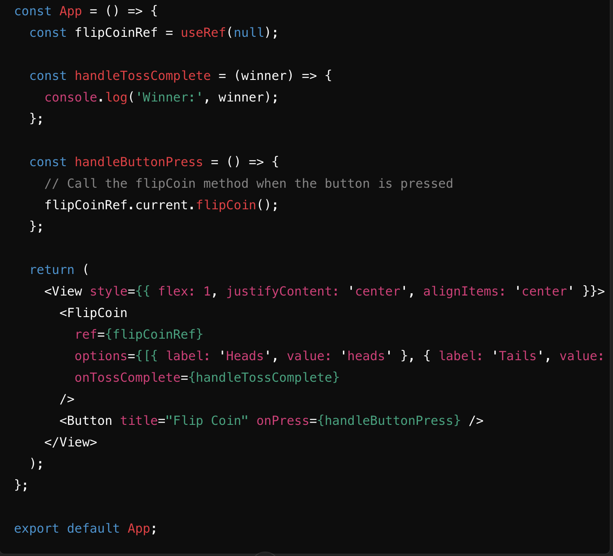

# FlipCoin Component

`react-native-flip-coin` is a React Native component that simulates a coin flip with customizable options. This component allows you to visually flip a coin to decide between two options, with full control over the appearance and behavior.

## Installation

To install the package, use npm or yarn:

```bash
npm install react-native-flip-coin
```


## Demo



## Props


| Prop                | Type                    | Default       | Description                                                                                                                                                             |
|---------------------|-------------------------|---------------|-------------------------------------------------------------------------------------------------------------------------------------------------------------------------|
| `options`           | `OptionsProps[]`        | -             | Array of options for the coin sides, where each option has a `label` and `value`.                                                                                   |
| `onTossComplete`    | `(winner: OptionsProps) => void` | -             | Callback function invoked when the coin flip is completed, providing the winner as an argument.                                                                       |
| `animationDuration` | `number`                | `400`         | Duration of each flip animation in milliseconds.                                                                                                                        |
| `flipCount`         | `number`                | `5`           | Number of times the coin should flip before stopping.                                                                                                                     |
| `customHeads`       | `ReactNode`             | -             | Custom content to be displayed when the coin shows heads.                                                                                                                |
| `customTails`       | `ReactNode`             | -             | Custom content to be displayed when the coin shows tails.                                                                                                                |
| `containerStyle`    | `ViewStyle`             | `{}`          | Custom style for the container view.                                                                                                                                     |
| `coinStyle`         | `ViewStyle`             | `{}`          | Custom style for the coin view.                                                                                                                                           |
| `disableOnPressCoin`| `boolean`               | `false`       | Whether to disable the coin flip when the coin is pressed.                                                                                                               |
| `headsTextStyle`    | `TextStyle`             | `{}`          | Custom style for the text displayed on heads.                                                                                                                             |
| `tailsTextStyle`    | `TextStyle`             | `{}`          | Custom style for the text displayed on tails.                                                                                                                             |
| `direction`         | `'clockwise' \| 'counterclockwise'` | `'clockwise'` | Direction in which the coin should rotate. Options are `"clockwise"` or `"counterclockwise"`.                                                                           |


## Method Usage

### `flipCoin()` 
To call the flipCoin method on the FlipCoin component, you need to create a reference to the component using the useRef hook in React. This reference allows you to access and trigger the flipCoin method from outside the component, such as in response to a button press or any other event in your application.



